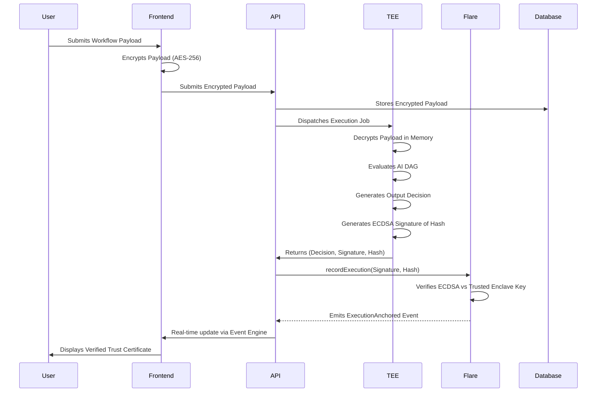

# Flare Confidential Compute Integration Guide

This document outlines how Confidra integrates with the Flare Network to provide mathematically verifiable confidential execution.

## Architectural Flow



## Smart Contracts

The core of the on-chain integration exists in `ConfidentialExecutionRegistry.sol` and `VerificationRegistry.sol`. 
These contracts act as an on-chain ledger of truth.

- **Gas Optimization**: Custom errors are used throughout to minimize deployment and execution gas costs.
- **Access Control**: Only the authorized TEE enclave key can produce a signature that `VerificationRegistry.sol` will accept.
- **Observability**: Indexed events (`ExecutionAnchored`) are emitted upon successful verification to allow real-time synchronization with the Confidra API.

## Live Event Engine (Polling)

Due to WebSocket limitations on public testnets, Confidra implements a resilient HTTP Polling Event Engine inside the `FlareService` (`apps/backend/src/blockchain/flare.service.ts`). 
This engine constantly queries the latest blocks for `ExecutionAnchored` events and synchronizes them to the local PostgreSQL database, powering the frontend's Transaction Center and Audit logs.

## Reusable Interfaces

Developers looking to integrate Flare Confidential Compute into their own microservices can import the `FlareService` provided in `apps/backend/src/blockchain/flare.service.ts`. 

Example usage:
```typescript
import { FlareService } from './flare.service';

// Inside a NestJS controller/service
constructor(private readonly flareService: FlareService) {}

async attestExecution() {
  const txHash = await this.flareService.submitExecutionAttestation(
    id,
    workflowId,
    hash,
    teeSignature
  );
  console.log(`Verified on Flare: ${txHash}`);
}
```
